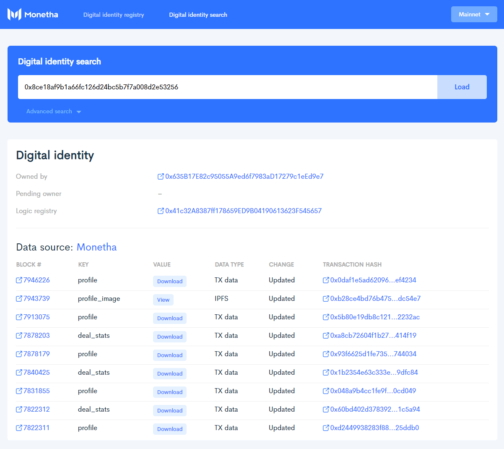

# Digital Identity Scanner

[![Build Status][1]][2]

[1]: https://travis-ci.org/monetha/passport-scanner.svg?branch=master
[2]: https://travis-ci.org/monetha/passport-scanner

Digital Identity Scanner is a Monetha Platform accompanying tool which helps to explore digital identity passports and information provided by multiple data sources.

In order to better understand what a digital identity passport is and how it works please look into [Verifiable data layer](https://github.com/monetha/reputation-layer) documentation of [Monetha platform](https://www.monetha.io/monetha-framework.pdf)

You can as well checkout the latest deployed version [https://scanner.monetha.io](https://scanner.monetha.io)



## Installation

Install [Node.js](https://nodejs.org/en/) 8+ LTS version.

Once you have Node installed, you can clone the repository and install its dependencies:

```shell
  git clone https://github.com/monetha/passport-scanner.git
  cd passport-scanner
  npm install
```

## Running in development environment

The development server is a combination of Node.js Express and Webpack. In order to start the development server use the command below:

```shell
  npm start
```

Once the compilation is done the web app will be available in your browser at [http://localhost:3000](http://localhost:3000). Hot Reloading is enabled so the browser will live update as you edit the source files.

Web application is pre-configured to communicate with 2 Ethereum networks: Mainnet, Ropsten. Monetha have boostrapped smart contracts, needed for passports on those networks. If you would like to use Rinkerby network or a local node - you can enter custom url in upper-right dropdown in running app.

Another way is to adjust constants in the file `src/constants/api.ts` (Ethereum RPC node urls and Etherscan urls) and `src/constants/addresses.ts` (`PassportFactory` contract addresses) to have your custom network pre-configured.

## Running in production environment

We have prepared a script that prepares an optimized version of the app.

```shell
  npm run build
```

After typescript compilation completes a folder `build` is created with all necessary assets for website hosting. This then can be deployed to any web server of your choice or [Amazon S3](https://docs.aws.amazon.com/AmazonS3/latest/dev/WebsiteHosting.html).

## Caveats

This tools is a work in progress and we believe there are multiple improvements that can be done to it.

- Digital Identity Scanner has a hard dependency on the version of `PassportFactory` in order to show all digital identities in a "Digital identity registry". Meaning in case of upgrade of `PassportFactory` contract this web app needs to make sure of backward compatibility.
- Though platform is capable of sensitive data provisioning, only public information can be read via Digital Identity Scanner application.

## Security

Please disclose any vulnerabilities found responsibly - report any security problems found to the maintainers privately.

## Contribution

Please submit bug reports, suggestions and pull requests to the [GitHub issue tracker](https://github.com/monetha/passport-scanner/issues).
